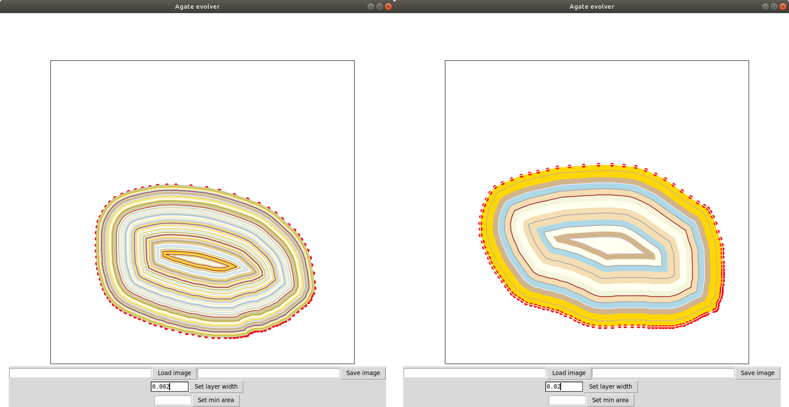
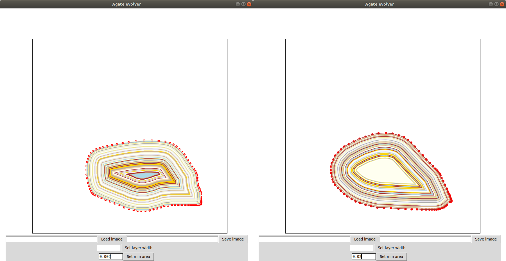

## Interfejs użytkownika
Okno programu przedstawione jest na rysunku 1.

*Rysunek 1. okno programu*

Składa się z następujących części:

1. **Obszar rysowania**
Użytkownik może zaznaczyć kontur agatu przytrzymując lewy przycisk myszy. W momencie puszczenia przycisku zostanie wygenerowany agat o zaznaczonym konturze. Gdy użytkownik zaczyna rysować nowy kontur, poprzedni rysunek jest usuwany. Przykład wygenerowanego agatu znajduje się na rysunku 2.

*Rysunek 2. wygenerowany agat*

2. **Wczytywanie obrazu**
Program umożliwia wczytanie obrazu w celu porównania wyników modelu z prawdziwymi agatami. Należy podać w polu **2a** ścieżkę do pliku z obrazem w formacie PNG (można pominąć rozszerzenie), a następnie nacisnąć przycisk **2b**. Obraz zostanie wyświetlony w obszarze rysowania. Następnie można zaznaczyć w dowolnym miejscu kontur, a wygenerowany agat zostanie wyświetlony na wczytanym obrazie. Przykład takiego użycia znajduje się na rysunku 3.

*Rysunek 3. agat wygenerowany na rysunku*

3. **Zapisywanie obrazu**
Wygenerowany agat można zapisać jako obraz PNG. W tym celu należy podać w polu **3a** nazwę wynikowego pliku, a następnie nacisnąć przycisk **3b**.

4. **Grubość warstwy**
Użytkownik może ustawić grubość warstwy generowanego agatu, wpisując wartość w polu **4a**, a następnie naciskając przycisk **4b** (dla odniesienia obszar rysowania ma wymiary 1x1). Domyślna wartość: 0.005. Przykład dwóch różnych grubości znajduje się na rysunku 4.

*Rysunek 4. różne grubości warstwy*

5. **Powierzchnia wewnętrzna**
Użytkownik może ustawić minimalną powierzchnię, dla której będą generowane warstwy, wpisując wartość w polu **5a**, a następnie naciskając przycisk **5b** (dla odniesienia obszar rysowania ma wymiary 1x1). Domyślna wartość: 0.001. Parametr ten określa jak duża powinna być jednolita powierzchnia w środku generowanego agatu. Przykład dwóch różnych powierzchni znajduje się na rysunku 5.

*Rysunek 5. różne powierzchnie wewnętrzne*

##Podsumowanie

